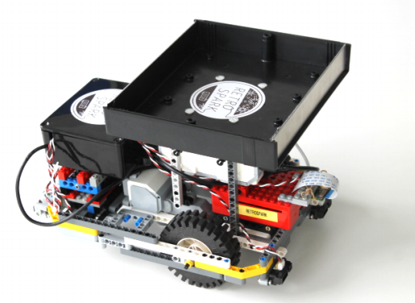
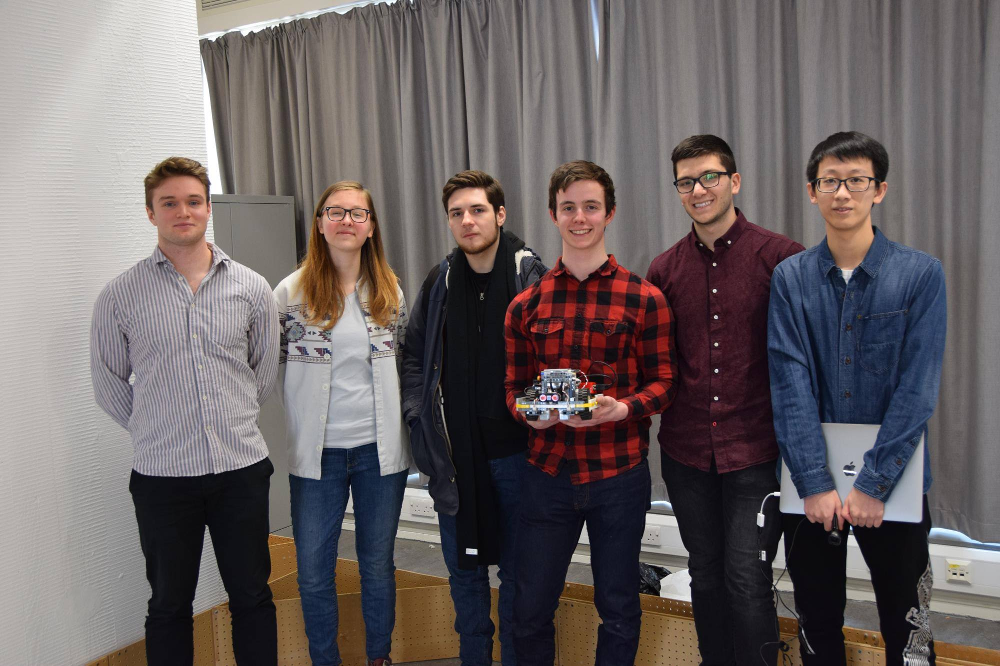

# OfficePal

## The project
OfficePal is a small differential drive robot built with Lego. It operates within an office environment where all desks are connected through black-coloured lines and can deliver items between desks using the tray attached on top of the robot. To perform these tasks it uses a vision-based line-following algorithm and can be controlled via an online web-app. Once OfficePal has multiple tasks, it can reschedule them and find the most optimal path to deal with all requests. To satisfy all of its computational needs, the robot is equipped with a Raspberry Pi 3 which enables it to execute all algorithms in real-time and host the web-app within the network it is currently connected to. Additionally, OfficePal can detect obstacles using its IR Sensors and can be controlled manually using a wireless joystick.

This project was releasied under the System Design Project(SDP) course at the University of Edinburgh during 2018. The aim of the course was to create a robot over the course of a semester that falls into the category of ’assistive robotics’. We were granted a great amount of freedom in deciding which path we wished to pursue and were allowed a predefined budget as well as a selection of robotics hardware to get us started. This opportunity allowed us to develop our project, OfficePal.

## The team
OfficePal was designed by team RetroSpark (group 19) comprising of team members:
- Alex Stewart
- Caelan Lekusa
- Callum Cheshire
- Ignat Georgiev
- Vaida Plankyte
- Yijie Chen

## Resources
All course-related documentation, reports and project plans are within the folder `Docs`.

The software of the robot is run on a distributed system consisting of
- Raspberry Pi 
- Lego Mindstorm EV3
- Arduino Uno

the relevant software bits reside within their own folders with documentation, guides and launch scripts.
